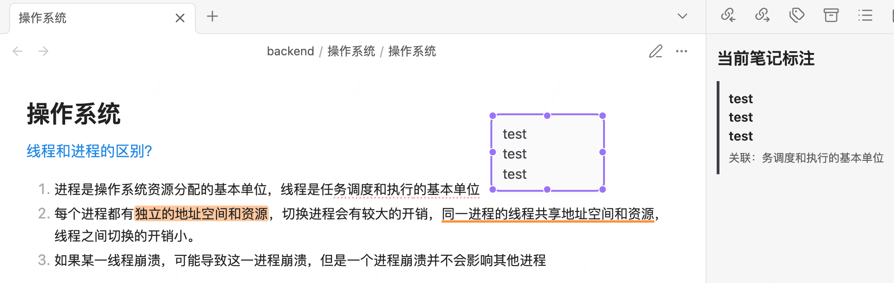
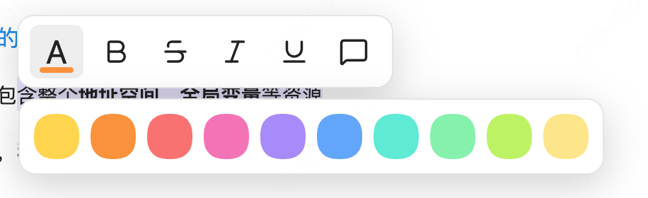

# MarginInk

MarginInk 是一个面向 Obsidian 阅读视图的独立标注插件。它把高亮、下划线、文字样式和浮动文本框作为视觉覆盖层保存，原 Markdown 笔记始终保持原样。

## <font color="#245bdb">界面预览</font>

阅读视图中的独立高亮、浮动文本框与当前笔记标注侧边栏：



选中文字后的图标式标注工具栏与圆形颜色面板：



## <font color="#245bdb">为什么用 MarginInk</font>

- **不修改源文件**：标注不会写进 `.md` 正文，不会污染笔记、干扰编辑、造成 Git diff 噪声或影响其他 Markdown 工具。
- **标注独立保存**：所有标注保存在插件的 `data.json`，可以保留原笔记的干净结构。
- **可安全导出**：需要分享或沉淀时，再导出一份带高亮、下划线和标注汇总的新笔记；原笔记不会被改动。
- **可用 Git 跨设备恢复**：将独立数据和笔记一起同步到另一台电脑，安装同一插件后可恢复标注内容、颜色、文字样式和文本框位置。
- **像阅读纸质资料一样标注**：选中文字即可高亮、加粗、斜体、下划线或删除线；右键可删除，`Cmd/Ctrl + Z` 可撤销。
- **PPT/Word 式浮动文本框**：可直接输入，拖动边框移动、拖动边和角缩放，并支持字体、字号、颜色、粗体、斜体、下划线、删除线和删除文本框。
- **可回看、可跳转**：右侧 MarginInk 标注栏仅展示当前笔记的浮动标注，点击即可跳转到对应文本框。

## <font color="#245bdb">功能一览</font>

- 阅读视图选中文字后，使用常用圆形颜色添加高亮。
- 为选中文字添加加粗、斜体、下划线、删除线等独立样式。
- 添加浮动文本框；文本框关联的原文会显示浅红色虚线下划线。
- 文本框默认随内容自动适应尺寸；拖动控制点后，对应方向改为手动尺寸。
- 右键删除文字标注，或在文本框工具栏删除文本框；均可撤销。
- 打开 MarginInk 侧边栏，浏览并跳转当前笔记中的浮动标注（高亮不显示在列表中）。
- 导出一份新的带标注 Markdown 笔记。

## <font color="#245bdb">本地安装</font>

1. 下载或克隆本仓库。
2. 将 `main.js`、`manifest.json` 与 `styles.css` 复制到你的 Obsidian 仓库中：

   ```text
   <你的仓库>/.obsidian/plugins/sidecar-annotations/
   ```

3. 重启 Obsidian，在 **设置 → 第三方插件** 中启用 **MarginInk**。

目录名沿用插件 ID `sidecar-annotations`，以保证已有标注数据兼容。

## <font color="#245bdb">标注数据与 Git 同步</font>

MarginInk 的标注数据位于：

```text
<你的仓库>/.obsidian/plugins/sidecar-annotations/data.json
```

本插件仓库默认不会提交该文件，因为其中可能包含私密笔记的标注文字与引用片段。

若要在自己的多台电脑之间同步标注，请将该 `data.json` 纳入你的**私有笔记仓库**版本控制，或随插件文件一起复制。另一台电脑需要：

1. 使用相同的插件 ID 和版本；
2. 拥有相同路径的原 Markdown 笔记；
3. 保持原文尽量一致。

若原文被大幅重写，插件会根据保存的选中文字和上下文尽量重新定位；完全一致的原文可获得最稳定的恢复效果。

## <font color="#245bdb">发布到 GitHub</font>

创建一个空 GitHub 仓库后，在本目录执行以下命令，并将占位地址替换为你的仓库地址：

```bash
git init
git add main.js manifest.json styles.css README.md .gitignore
git commit -m "feat: 发布 MarginInk Obsidian 插件"
git branch -M main
git remote add origin <你的 GitHub 仓库地址>
git push -u origin main
```

## <font color="#245bdb">开发说明</font>

这是一个纯 JavaScript 的 Obsidian 插件包，不需要构建步骤。修改代码后，重载 Obsidian 或禁用再启用 MarginInk 即可加载新版本。
